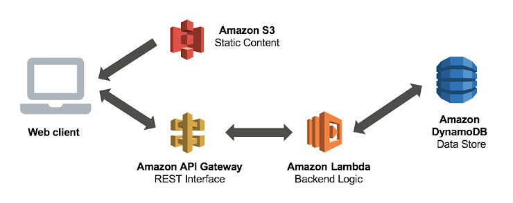
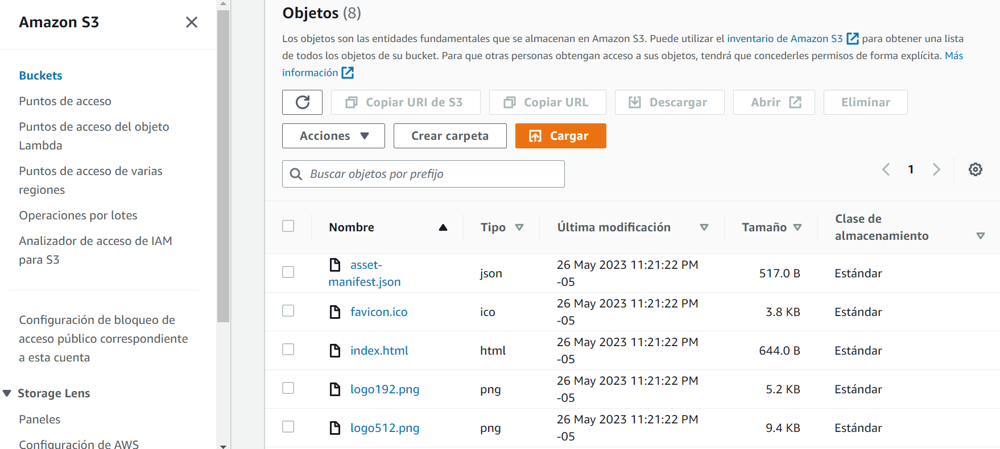

# Project

A code exam for a job position using react and aws services (lambda, s3,dynamo db and api gateway)

## Tabla de Contenidos

- [Requirements](#requirements)
- [Architecture](#architecture)
- [Instalation](#instalation)
- [Use](#use)
- [Evidences](#evidences)
- [Contribution](#contribution)

## Requirements

aws account, git and npm

## Architecture

## Instalation

-git clone (url)

-s3 implementation in aws console

-api gateway implementation in aws console

-lambda implementation in aws console

-dynamo db implementation in aws console

-npm install

-npm build 

-aws s3 sync build/ s3://(bucket)

## Use

##### React

some react code

##### Lambda

##### Api Gateway

##### S3

files

permissions

redirect

##### Dynamo

## Evidences

AWS

http://clients-hosting-code-test.s3-website-us-east-1.amazonaws.com/

Local

## Contribution

A yml could be added where the aws services are deployed